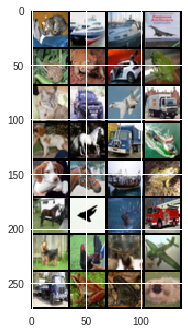
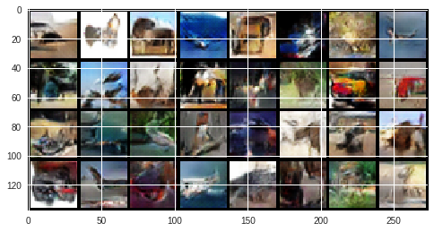

# Deep-Convolutional-GAN
Deep Convolutional GAN applied to [CIFAR-10](https://www.cs.toronto.edu/~kriz/cifar.html) dataset. We can find the original paper [here](https://arxiv.org/pdf/1511.06434.pdf).

# Presentation
Generative Adversarial Networks are an elegant way to train generative models and, as opposed to autoencoders, managed to generate realistic images. We have implemented a version of GANs using convolutional layers, following the original paper. Using only 20 epochs, the model is able to generate good samples.

## Performance Evaluation
The success of the DCGAN will be tested as follows:
  - **By the model's training error**. Need to achieve relatively balanced errors for the generator and the discriminator of your model in order to sample realistic images from the generator. Visualisation of training losses curves and visualisations of generated samples in the respective cells. 
  - **By avoiding mode collapse**. A common problem of training GANs is that they end up generating only a few different samples (if not only one), rather than learning the whole distribution of the training data. This problem is referred to as mode collapse. 

### True samples

### Generated samples

## Mode collapse problem

One can notice two different mode collapse problems during the training of a GAN:
1) Complete mode collapse: the generator is only able to predict one single image
2) Partial mode collapse: the generator predicts similar images that belongs to one or a subset of all classes that are used, and the generated samples lacks diversity.
  
In order to overcome these problems, one can:
1) Use multiple GANs: we can use a single GAN for each class
2) Modify the loss function of the generator in order to encourage diversity: just add a term in the loss of the generator that measures the diversity in each batch.
3) Anticipate counterplay: This approach gives an opportunity for each player to anticipate the counterplay when updating in the future. 
  This will prevent the generator to jump between two modes and never being able to predict more than one mode.
  However, this increases computational time.
 
